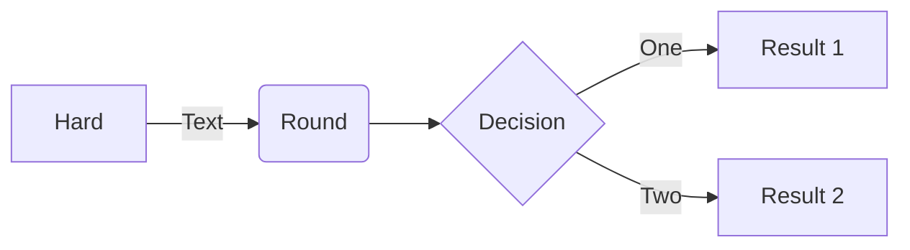

# gh-sandbox
GitHub Sandbox

# You can type math in GitHub Markdown

## Example 1

```latex
$$
\int_{-\infty}^\infty \frac{1}{\sqrt{2\pi\sigma^2}} \exp\left(-\frac{(x - \mu) ^ 2}{2\sigma^2}\right)dx = 1
$$
```

$$
\int_{-\infty}^\infty \frac{1}{\sqrt{2\pi\sigma^2}} \exp\left(-\frac{(x - \mu) ^ 2}{2\sigma^2}\right)dx = 1
$$

***

## Example 2

```latex
$$
\begin{aligned}
  \alpha ^ 2 + \beta ^ 2 &= \gamma ^ 2 \\
  a ^ 2 + b ^ 2 &= c ^ 2
\end{aligned}
$$
```
$$
\begin{aligned}
  \alpha ^ 2 + \beta ^ 2 &= \gamma ^ 2 \\
  a ^ 2 + b ^ 2 &= c ^ 2
\end{aligned}
$$

***

## Example 3

You can even do flowcharts.

```
flowchart LR

A[Hard] -->|Text| B(Round)
B --> C{Decision}
C -->|One| D[Result 1]
C -->|Two| E[Result 2]
```



***
